# Visual DSA Pattern Guide

These Mermaid diagrams are designed for quick recall. GitHub renders them directly; redraw them by hand when revising.

## Two pointers

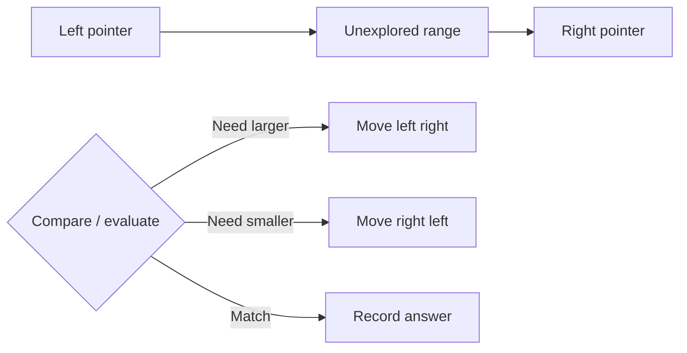

**Invariant:** everything outside the pointers has been processed or proved unable to improve the answer.

## Sliding window

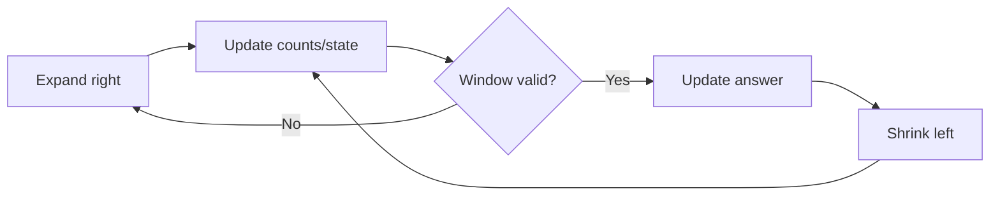

**Recognition signal:** a contiguous range and a constraint that can be maintained incrementally.

## Prefix sums

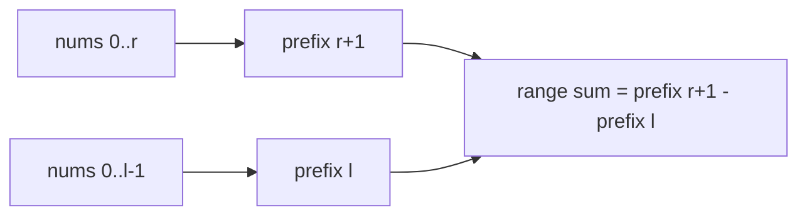

For target-sum subarrays, store counts of earlier prefixes: `current_prefix - earlier_prefix = target`.

## Monotonic stack

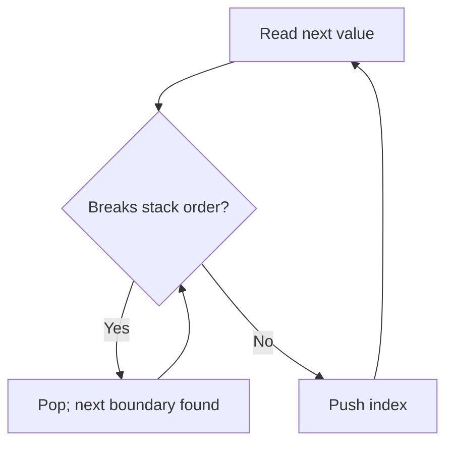

Each index is pushed and popped at most once, which explains the linear-time bound.

## Binary search on answer

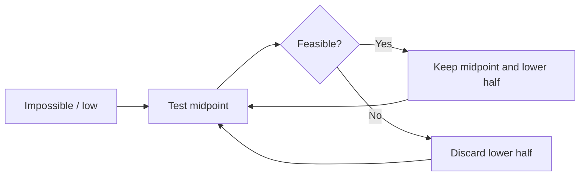

First prove the predicate is monotonic; then choose whether you need the first true or last false boundary.

## Tree DFS return values

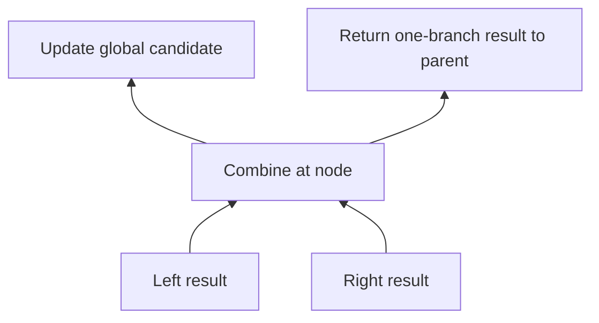

Separate the value a parent may extend from the candidate that is complete at the current node.

## BFS levels and multi-source BFS

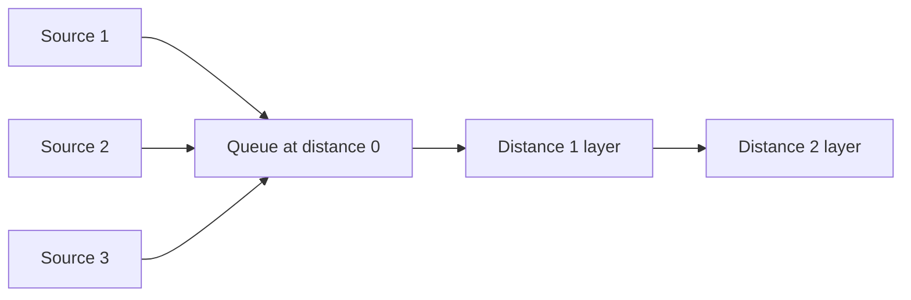

Mark nodes visited when enqueuing, not when dequeuing, to avoid duplicate work.

## Topological sort

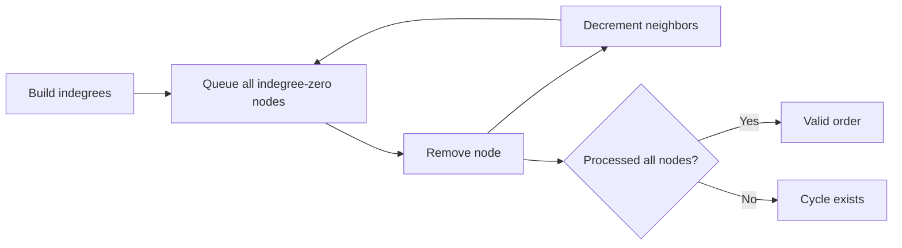

## Backtracking decision tree

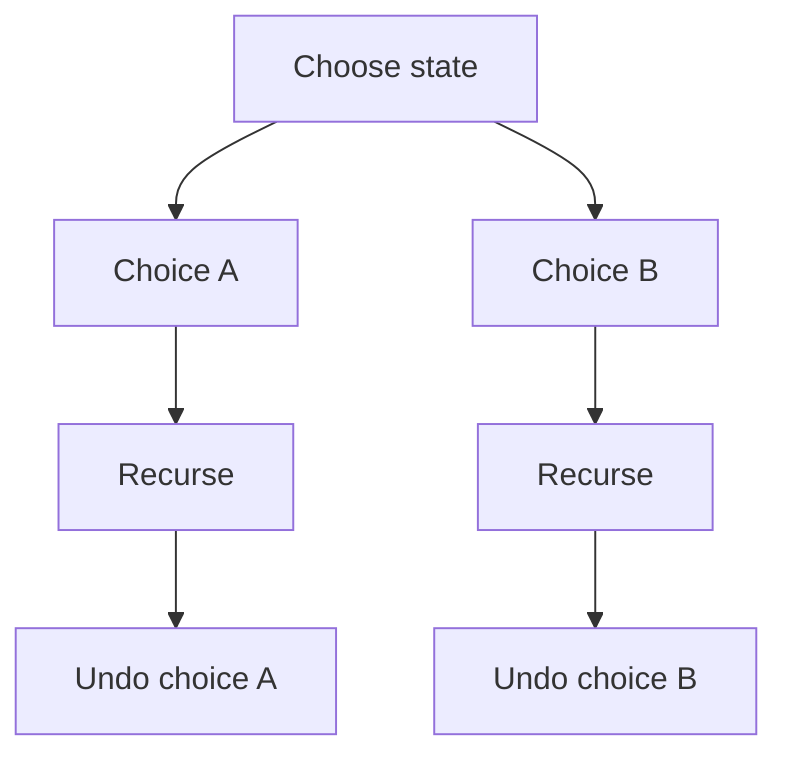

The state must be restored exactly before exploring the next sibling.

## Dynamic programming workflow

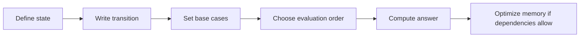

## Union Find

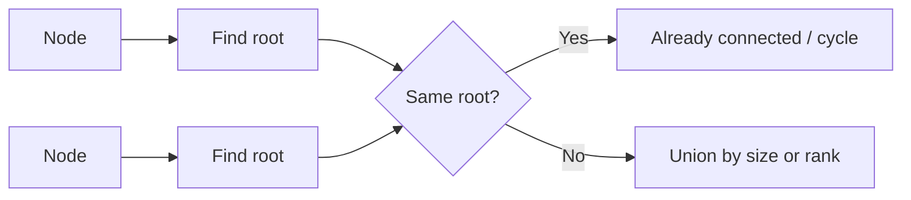

Path compression flattens find paths; union by size prevents tall trees.

## Heap for top-k

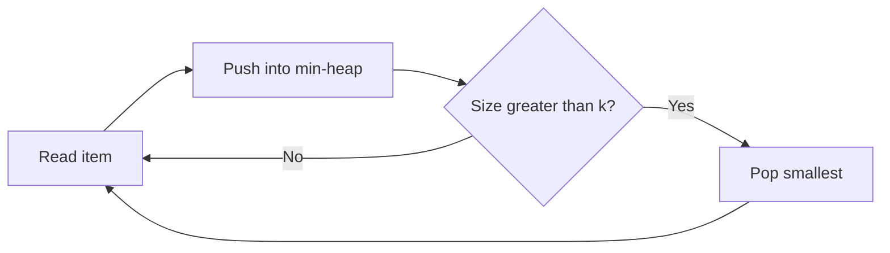

The heap contains the best `k` items from the processed prefix.
