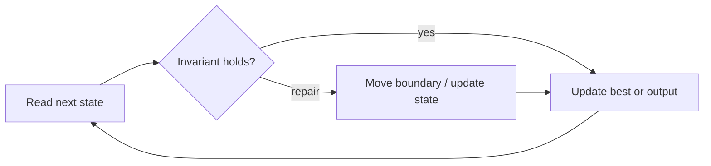

# 3Sum

**Difficulty:** Medium
**Problem:** [LeetCode](https://leetcode.com/problems/3sum/)
**Implementation:** [`solution.py`](solution.py) · **Tests:** [`test_solution.py`](test_solution.py)

## Restatement

Return every unique value triplet whose elements come from distinct indices and sum to zero. The order of returned triplets is irrelevant.

## Brute force

Enumerate every index triple, sort each zero-sum result, and deduplicate with a set. This takes O(n³) time.

## Optimized approach

Sort the values. Fix one value, then move two pointers through the remaining sorted range. Skip repeated fixed and pointer values to emit each triplet once.

### Invariant and correctness

For a fixed first value, moving left raises the sum and moving right lowers it, so every discarded region is impossible. Thus every reported candidate is valid, and no candidate capable of improving the answer is discarded. When the scan finishes, the stored result is optimal.

## Trace / diagram



## Python solution

```python
def three_sum(nums: list[int]) -> list[list[int]]:
    """Return all unique value triplets whose sum is zero."""
    nums = sorted(nums)
    result: list[list[int]] = []
    for first in range(len(nums) - 2):
        if first and nums[first] == nums[first - 1]:
            continue
        if nums[first] > 0:
            break
        left, right = first + 1, len(nums) - 1
        while left < right:
            total = nums[first] + nums[left] + nums[right]
            if total < 0:
                left += 1
            elif total > 0:
                right -= 1
            else:
                result.append([nums[first], nums[left], nums[right]])
                left += 1
                right -= 1
                while left < right and nums[left] == nums[left - 1]:
                    left += 1
                while left < right and nums[right] == nums[right + 1]:
                    right -= 1
    return result
```

## Complexity

- **Time:** O(n²)
- **Space:** O(n) for the sorted copy

## Edge cases covered

- Empty or minimum-sized inputs where permitted
- Duplicate values and repeated characters
- Zeros and negative values where applicable
- No valid answer

Run the tests from the repository root:

```bash
python topics/02-arrays-and-strings/problems/run_tests.py
```
