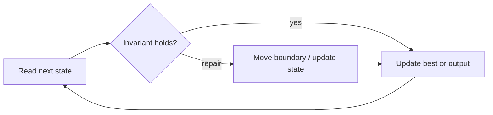

# Best Time to Buy and Sell Stock

**Difficulty:** Easy
**Problem:** [LeetCode](https://leetcode.com/problems/best-time-to-buy-and-sell-stock/)
**Implementation:** [`solution.py`](solution.py) · **Tests:** [`test_solution.py`](test_solution.py)

## Restatement

Given daily prices, choose one day to buy and a later day to sell. Return the maximum non-negative profit.

## Brute force

Evaluate every valid buy/sell day pair and retain the largest difference. This takes O(n²) time and O(1) space.

## Optimized approach

Scan once, maintaining the cheapest valid buying price seen before or at the current day and the best profit obtainable so far.

### Invariant and correctness

After each day, `minimum` is the minimum prefix price and `best` is the best transaction ending anywhere in that prefix. Thus every reported candidate is valid, and no candidate capable of improving the answer is discarded. When the scan finishes, the stored result is optimal.

## Trace / diagram



## Python solution

```python
def max_profit(prices: list[int]) -> int:
    """Return the largest profit from one buy followed by one sell."""
    minimum = float("inf")
    best = 0
    for price in prices:
        minimum = min(minimum, price)
        best = max(best, price - minimum)
    return best
```

## Complexity

- **Time:** O(n)
- **Space:** O(1)

## Edge cases covered

- Empty or minimum-sized inputs where permitted
- Duplicate values and repeated characters
- Zeros and negative values where applicable
- No valid answer

Run the tests from the repository root:

```bash
python topics/02-arrays-and-strings/problems/run_tests.py
```
