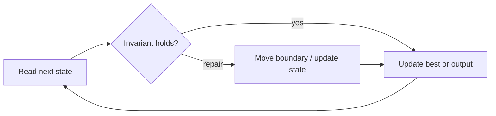

# Container With Most Water

**Difficulty:** Medium
**Problem:** [LeetCode](https://leetcode.com/problems/container-with-most-water/)
**Implementation:** [`solution.py`](solution.py) · **Tests:** [`test_solution.py`](test_solution.py)

## Restatement

Treat each height as a vertical line. Choose two lines that maximize `width × shorter_height` and return that area.

## Brute force

Evaluate the area formed by every pair of lines. This is O(n²) time and O(1) space.

## Optimized approach

Start with the widest pair. Move the shorter wall inward because keeping it while reducing width can never improve the area.

### Invariant and correctness

After moving a shorter boundary, no pair using that discarded boundary can beat the area already checked at its maximum possible width. Thus every reported candidate is valid, and no candidate capable of improving the answer is discarded. When the scan finishes, the stored result is optimal.

## Trace / diagram



## Python solution

```python
def max_area(height: list[int]) -> int:
    """Return the maximum area formed by two vertical lines."""
    left, right = 0, len(height) - 1
    best = 0
    while left < right:
        best = max(best, (right - left) * min(height[left], height[right]))
        if height[left] <= height[right]:
            left += 1
        else:
            right -= 1
    return best
```

## Complexity

- **Time:** O(n)
- **Space:** O(1)

## Edge cases covered

- Empty or minimum-sized inputs where permitted
- Duplicate values and repeated characters
- Zeros and negative values where applicable
- No valid answer

Run the tests from the repository root:

```bash
python topics/02-arrays-and-strings/problems/run_tests.py
```
