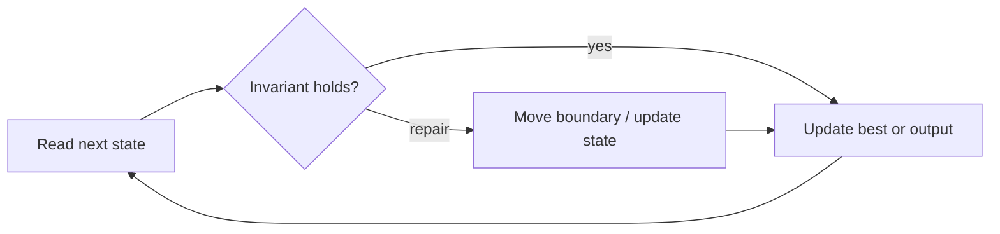

# Longest Substring Without Repeating Characters

**Difficulty:** Medium
**Problem:** [LeetCode](https://leetcode.com/problems/longest-substring-without-repeating-characters/)
**Implementation:** [`solution.py`](solution.py) · **Tests:** [`test_solution.py`](test_solution.py)

## Restatement

Return the length of the longest contiguous substring containing no repeated character.

## Brute force

Start at every character and extend a set-backed substring until its first duplicate. This takes O(n²) time in the worst case and O(k) space.

## Optimized approach

Maintain a duplicate-free sliding window. A repeated character jumps the left edge just beyond that character's latest index, but never backward.

### Invariant and correctness

The window `text[left:right+1]` contains no duplicate, and `left` is the smallest valid boundary after processing `right`. Thus every reported candidate is valid, and no candidate capable of improving the answer is discarded. When the scan finishes, the stored result is optimal.

## Trace / diagram



## Python solution

```python
def length_of_longest_substring(text: str) -> int:
    """Return the longest substring length containing unique characters."""
    last_seen: dict[str, int] = {}
    left = best = 0
    for right, char in enumerate(text):
        if char in last_seen and last_seen[char] >= left:
            left = last_seen[char] + 1
        last_seen[char] = right
        best = max(best, right - left + 1)
    return best
```

## Complexity

- **Time:** O(n)
- **Space:** O(k)

## Edge cases covered

- Empty or minimum-sized inputs where permitted
- Duplicate values and repeated characters
- Zeros and negative values where applicable
- No valid answer

Run the tests from the repository root:

```bash
python topics/02-arrays-and-strings/problems/run_tests.py
```
