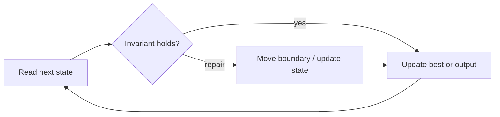

# Maximum Subarray

**Difficulty:** Medium
**Problem:** [LeetCode](https://leetcode.com/problems/maximum-subarray/)
**Implementation:** [`solution.py`](solution.py) · **Tests:** [`test_solution.py`](test_solution.py)

## Restatement

Return the largest sum among all non-empty contiguous subarrays. Inputs must contain at least one value.

## Brute force

Choose every start and end index and sum each range. Incrementally extending each start improves the naive O(n³) method to O(n²), but both repeat overlapping work.

## Optimized approach

Kadane's algorithm decides whether the best subarray ending here should extend the previous one or restart at the current value.

### Invariant and correctness

`ending_here` is the best sum ending exactly at the current index; `best` is the maximum over every ending index processed. Thus every reported candidate is valid, and no candidate capable of improving the answer is discarded. When the scan finishes, the stored result is optimal.

## Trace / diagram



## Python solution

```python
def max_subarray(nums: list[int]) -> int:
    """Return the maximum sum of a non-empty contiguous subarray."""
    if not nums:
        raise ValueError("nums must be non-empty")
    ending_here = best = nums[0]
    for value in nums[1:]:
        ending_here = max(value, ending_here + value)
        best = max(best, ending_here)
    return best
```

## Complexity

- **Time:** O(n)
- **Space:** O(1)

## Edge cases covered

- Empty or minimum-sized inputs where permitted
- Duplicate values and repeated characters
- Zeros and negative values where applicable
- No valid answer

Run the tests from the repository root:

```bash
python topics/02-arrays-and-strings/problems/run_tests.py
```
