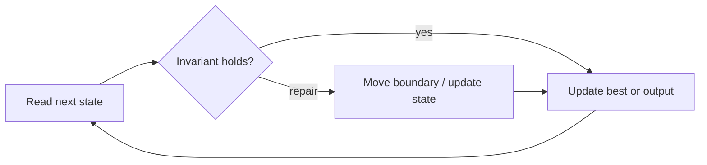

# Minimum Window Substring

**Difficulty:** Hard
**Problem:** [LeetCode](https://leetcode.com/problems/minimum-window-substring/)
**Implementation:** [`solution.py`](solution.py) · **Tests:** [`test_solution.py`](test_solution.py)

## Restatement

Return the shortest substring of `source` containing every character of `target`, including duplicate counts. Return an empty string if none exists.

## Brute force

Enumerate all O(n²) source substrings and compare character counts against the target, adding another O(k) check per candidate.

## Optimized approach

Expand until all required character occurrences are covered. Then remove surplus characters from the left, record the minimal valid window, and advance once to search for the next candidate.

### Invariant and correctness

`missing` counts target occurrences not covered by the current window; negative map counts represent surplus characters. Thus every reported candidate is valid, and no candidate capable of improving the answer is discarded. When the scan finishes, the stored result is optimal.

## Trace / diagram



## Python solution

```python
from collections import Counter


def min_window(source: str, target: str) -> str:
    """Return the shortest source substring containing target's counts."""
    if not target or not source:
        return ""
    needed = Counter(target)
    missing = len(target)
    left = start = end = 0
    for right, char in enumerate(source, 1):
        if needed[char] > 0:
            missing -= 1
        needed[char] -= 1
        if missing == 0:
            while left < right and needed[source[left]] < 0:
                needed[source[left]] += 1
                left += 1
            if end == 0 or right - left < end - start:
                start, end = left, right
            needed[source[left]] += 1
            missing += 1
            left += 1
    return source[start:end]
```

## Complexity

- **Time:** O(n + m)
- **Space:** O(k)

## Edge cases covered

- Empty or minimum-sized inputs where permitted
- Duplicate values and repeated characters
- Zeros and negative values where applicable
- No valid answer

Run the tests from the repository root:

```bash
python topics/02-arrays-and-strings/problems/run_tests.py
```
