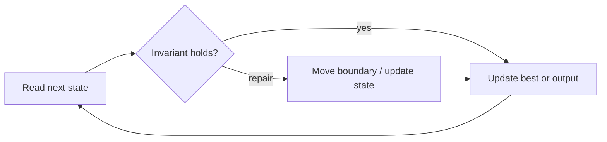

# Product of Array Except Self

**Difficulty:** Medium
**Problem:** [LeetCode](https://leetcode.com/problems/product-of-array-except-self/)
**Implementation:** [`solution.py`](solution.py) · **Tests:** [`test_solution.py`](test_solution.py)

## Restatement

For every index, return the product of all input values except the value at that index, without using division.

## Brute force

For each output index, scan every other input value and multiply it. This takes O(n²) time and O(1) auxiliary space beyond the output.

## Optimized approach

Write the product strictly to the left of every index, then multiply it by a right-to-left suffix product. Division is unnecessary, so zeros work naturally.

### Invariant and correctness

Before each pass updates an index, its accumulator equals the product strictly outside that index on the processed side. Thus every reported candidate is valid, and no candidate capable of improving the answer is discarded. When the scan finishes, the stored result is optimal.

## Trace / diagram



## Python solution

```python
def product_except_self(nums: list[int]) -> list[int]:
    """Return products of all values except the value at each index."""
    answer = [1] * len(nums)
    prefix = 1
    for index, value in enumerate(nums):
        answer[index] = prefix
        prefix *= value
    suffix = 1
    for index in range(len(nums) - 1, -1, -1):
        answer[index] *= suffix
        suffix *= nums[index]
    return answer
```

## Complexity

- **Time:** O(n)
- **Space:** O(1) extra (excluding output)

## Edge cases covered

- Empty or minimum-sized inputs where permitted
- Duplicate values and repeated characters
- Zeros and negative values where applicable
- No valid answer

Run the tests from the repository root:

```bash
python topics/02-arrays-and-strings/problems/run_tests.py
```
