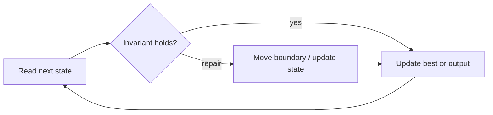

# Rotate Image

**Difficulty:** Medium
**Problem:** [LeetCode](https://leetcode.com/problems/rotate-image/)
**Implementation:** [`solution.py`](solution.py) · **Tests:** [`test_solution.py`](test_solution.py)

## Restatement

Rotate an n × n matrix 90 degrees clockwise in place. The function returns `None` and mutates the matrix.

## Brute force

Build a second n × n matrix and place each original value at `(column, n - 1 - row)`. This is O(n²) time but uses O(n²) extra space.

## Optimized approach

A clockwise rotation equals transposing across the main diagonal and then reversing every row. Both operations are in place.

### Invariant and correctness

After transposition, original `(r, c)` is at `(c, r)`; row reversal moves it to `(c, n-1-r)`, its rotated location. Thus every reported candidate is valid, and no candidate capable of improving the answer is discarded. When the scan finishes, the stored result is optimal.

## Trace / diagram



## Python solution

```python
def rotate(matrix: list[list[int]]) -> None:
    """Rotate a square matrix 90 degrees clockwise in place."""
    size = len(matrix)
    if any(len(row) != size for row in matrix):
        raise ValueError("matrix must be square")
    for row in range(size):
        for column in range(row + 1, size):
            matrix[row][column], matrix[column][row] = (matrix[column][row], matrix[row][column])
    for row in matrix:
        row.reverse()
```

## Complexity

- **Time:** O(n²)
- **Space:** O(1)

## Edge cases covered

- Empty or minimum-sized inputs where permitted
- Duplicate values and repeated characters
- Zeros and negative values where applicable
- No valid answer

Run the tests from the repository root:

```bash
python topics/02-arrays-and-strings/problems/run_tests.py
```
