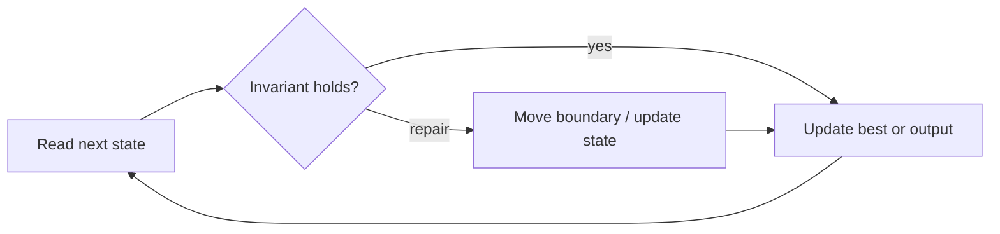

# Spiral Matrix

**Difficulty:** Medium
**Problem:** [LeetCode](https://leetcode.com/problems/spiral-matrix/)
**Implementation:** [`solution.py`](solution.py) · **Tests:** [`test_solution.py`](test_solution.py)

## Restatement

Return all values of a rectangular matrix in clockwise spiral order, beginning at the top-left cell.

## Brute force

Track a visited matrix and simulate movement, turning whenever the next cell is invalid. This is O(mn) time but uses O(mn) avoidable space.

## Optimized approach

Keep four boundaries around the unvisited rectangle. Traverse its top, right, bottom, and left sides, checking boundaries before the latter two to avoid duplicates.

### Invariant and correctness

At each loop start, every cell outside `[top..bottom] × [left..right]` has been emitted exactly once. Thus every reported candidate is valid, and no candidate capable of improving the answer is discarded. When the scan finishes, the stored result is optimal.

## Trace / diagram



## Python solution

```python
def spiral_order(matrix: list[list[int]]) -> list[int]:
    """Return matrix values in clockwise spiral order."""
    if not matrix or not matrix[0]:
        return []
    top, bottom = 0, len(matrix) - 1
    left, right = 0, len(matrix[0]) - 1
    result: list[int] = []
    while top <= bottom and left <= right:
        result.extend(matrix[top][left:right + 1])
        top += 1
        for row in range(top, bottom + 1):
            result.append(matrix[row][right])
        right -= 1
        if top <= bottom:
            result.extend(reversed(matrix[bottom][left:right + 1]))
            bottom -= 1
        if left <= right:
            for row in range(bottom, top - 1, -1):
                result.append(matrix[row][left])
            left += 1
    return result
```

## Complexity

- **Time:** O(mn)
- **Space:** O(1) extra (excluding output)

## Edge cases covered

- Empty or minimum-sized inputs where permitted
- Duplicate values and repeated characters
- Zeros and negative values where applicable
- No valid answer

Run the tests from the repository root:

```bash
python topics/02-arrays-and-strings/problems/run_tests.py
```
