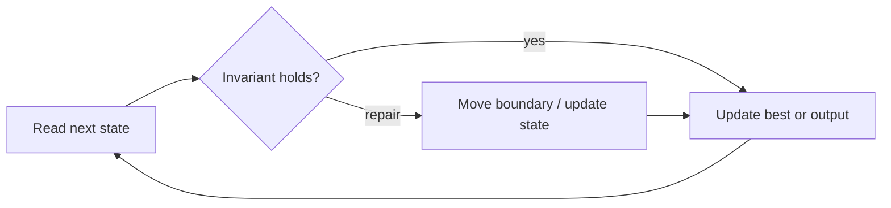

# Subarray Sum Equals K

**Difficulty:** Medium
**Problem:** [LeetCode](https://leetcode.com/problems/subarray-sum-equals-k/)
**Implementation:** [`solution.py`](solution.py) · **Tests:** [`test_solution.py`](test_solution.py)

## Restatement

Count contiguous, non-empty subarrays whose values sum to the target. Values may be negative or zero.

## Brute force

For every start index, extend an end index while maintaining a running sum. This takes O(n²) time and O(1) extra space.

## Optimized approach

If the current prefix sum is `p`, every earlier prefix `p - target` starts a target-sum subarray. Store frequencies because several starts may be valid.

### Invariant and correctness

Before adding the current prefix, the map counts all prefixes ending strictly earlier, including the empty prefix. Thus every reported candidate is valid, and no candidate capable of improving the answer is discarded. When the scan finishes, the stored result is optimal.

## Trace / diagram



## Python solution

```python
from collections import defaultdict


def subarray_sum(nums: list[int], target: int) -> int:
    """Count contiguous subarrays whose sum equals target."""
    prefix_count = defaultdict(int)
    prefix_count[0] = 1
    prefix = answer = 0
    for value in nums:
        prefix += value
        answer += prefix_count[prefix - target]
        prefix_count[prefix] += 1
    return answer
```

## Complexity

- **Time:** O(n)
- **Space:** O(n)

## Edge cases covered

- Empty or minimum-sized inputs where permitted
- Duplicate values and repeated characters
- Zeros and negative values where applicable
- No valid answer

Run the tests from the repository root:

```bash
python topics/02-arrays-and-strings/problems/run_tests.py
```
