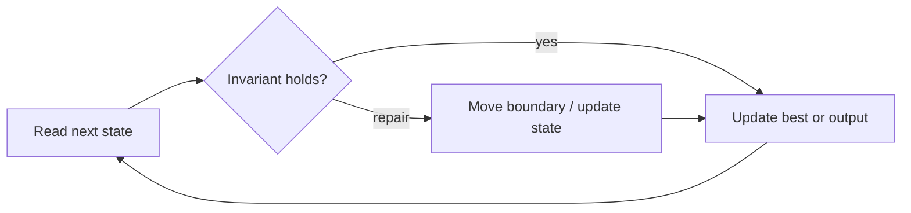

# Two Sum

**Difficulty:** Easy
**Problem:** [LeetCode](https://leetcode.com/problems/two-sum/)
**Implementation:** [`solution.py`](solution.py) · **Tests:** [`test_solution.py`](test_solution.py)

## Restatement

Given an integer array and a target, return indices of two distinct elements whose sum is the target. Return an empty list when no pair exists.

## Brute force

Check every index pair `(i, j)` with `i < j` and return the first target-sum pair. This takes O(n²) time and O(1) extra space.

## Optimized approach

A map stores each previously seen value and its index. Before inserting the current value, look for its complement. This ordering prevents reusing one element.

### Invariant and correctness

At index `i`, `seen` contains exactly the values at indices smaller than `i`. A match therefore uses two distinct indices. Thus every reported candidate is valid, and no candidate capable of improving the answer is discarded. When the scan finishes, the stored result is optimal.

## Trace / diagram



## Python solution

```python
def two_sum(nums: list[int], target: int) -> list[int]:
    """Return indices of two distinct values that add to target."""
    seen: dict[int, int] = {}
    for index, value in enumerate(nums):
        complement = target - value
        if complement in seen:
            return [seen[complement], index]
        seen[value] = index
    return []
```

## Complexity

- **Time:** O(n)
- **Space:** O(n)

## Edge cases covered

- Empty or minimum-sized inputs where permitted
- Duplicate values and repeated characters
- Zeros and negative values where applicable
- No valid answer

Run the tests from the repository root:

```bash
python topics/02-arrays-and-strings/problems/run_tests.py
```
